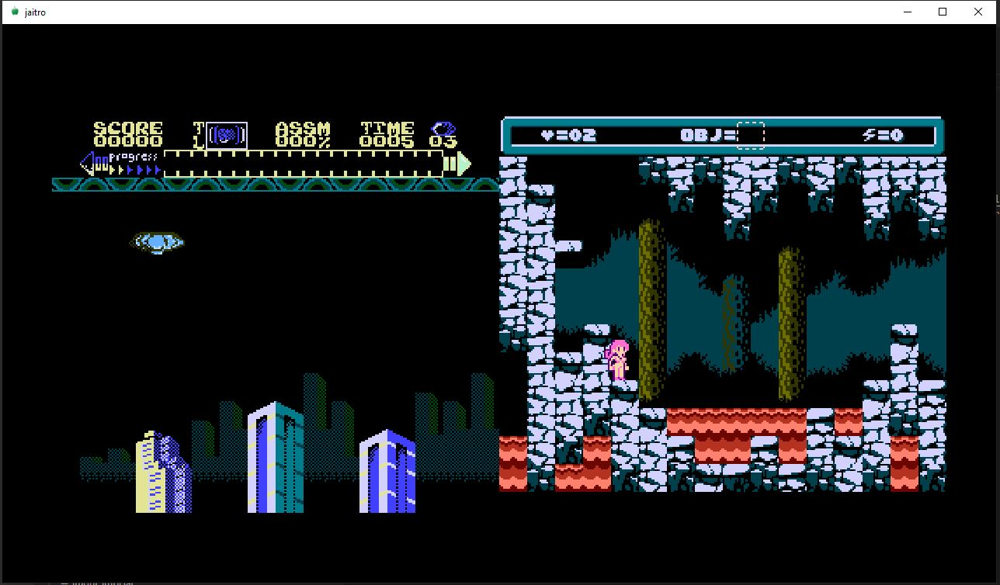

# jaitro

A minimal libretro frontend with support for multiple cores running simulatanously.



Thank you to [nanoarch](https://github.com/heuripedes/nanoarch) for providing an education resource on how to make a libretro frontend.

## Running

Run `run_tree\jaitro.exe`.

## Configuration

Use `run_tree/jaitro.cfg` to these change configuration values:

```
core "nes/mesen_libretro.dll"
```

Specify a path to a libretro core DLL. A path to the cores is prepended to your configuration value, so for example the full path above becomes `data/cores/nes/mesen_libretro.dll`.

```
rom "nes/assimilate_full_dl.nes|nes/mojon-twins--cheril-the-goddess.nes"
```

Specify a path to one or more ROMs to load and play, separated by a `|` character. A path to the ROMs is prepended to your configuration value, so for example the full path above becomes `data/roms/nes/assimilate_full_...`.

## Controls

* Arrow keys = NES DPAD
* X = NES A
* Z = NES B
* Enter = NES START
* Backspace = NES SELECT

From `RetroGL.jai`:

```
        cast(Key_Code)(#char "X"), DEVICE_ID_JOYPAD_A);
        cast(Key_Code)(#char "Z"), DEVICE_ID_JOYPAD_B);
        cast(Key_Code)(#char "A"), DEVICE_ID_JOYPAD_Y);
        cast(Key_Code)(#char "S"), DEVICE_ID_JOYPAD_X);
        Key_Code.ARROW_UP, DEVICE_ID_JOYPAD_UP);
        Key_Code.ARROW_DOWN, DEVICE_ID_JOYPAD_DOWN);
        Key_Code.ARROW_LEFT, DEVICE_ID_JOYPAD_LEFT);
        Key_Code.ARROW_RIGHT, DEVICE_ID_JOYPAD_RIGHT);
        Key_Code.ENTER, DEVICE_ID_JOYPAD_START);
        Key_Code.BACKSPACE, DEVICE_ID_JOYPAD_SELECT);
```

## TODO

* Audio
* Input binding
* Scriptability for fun multigame hacks

## ROMS

This repository has a few free homebrew NES roms:

See license information [here](https://github.com/retrobrews/nes-games).

* [Assimilate](https://nessylum.wordpress.com/) - the dev's website has a [Donate button](https://nessylum.wordpress.com/buy-now/)!
* [Cheril the Goddess](http://www.mojontwins.com/) by The Mojon Twins - [see instructions and README here](https://github.com/retrobrews/nes-games/blob/master/cheril-the-goddess.txt)

